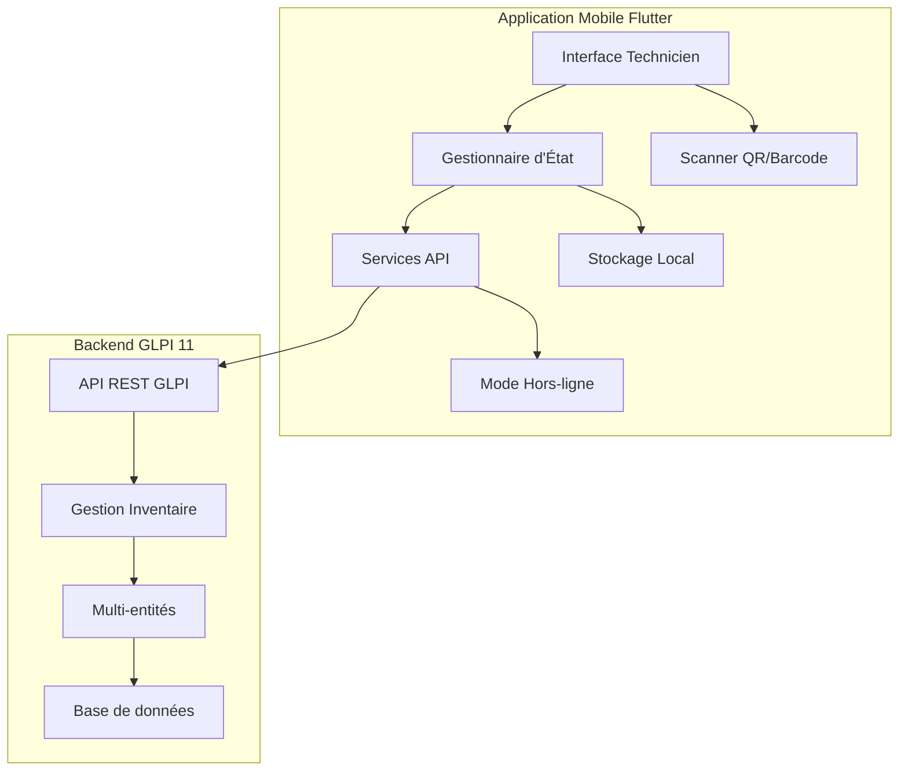
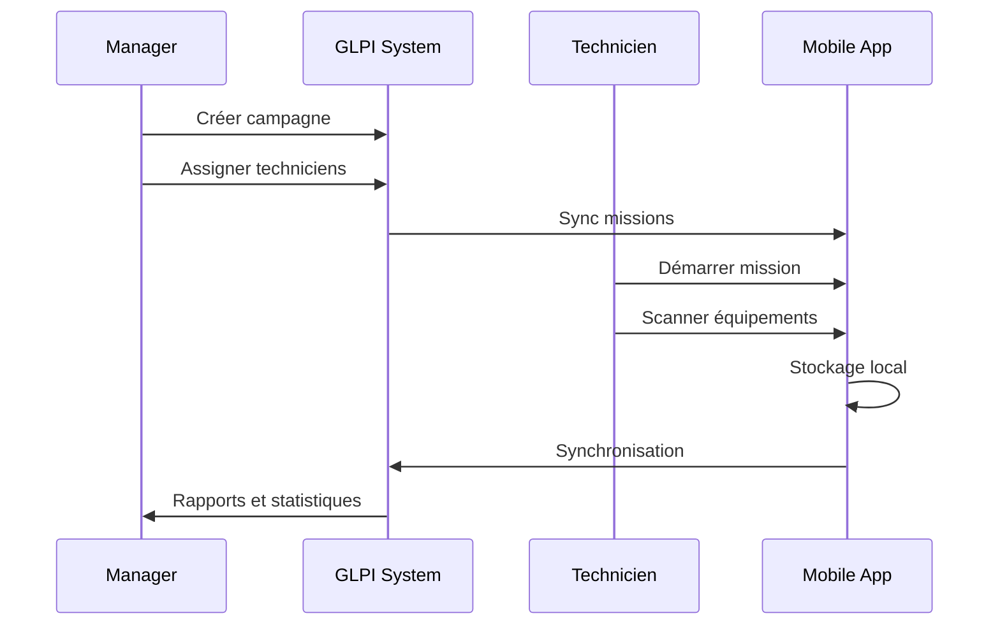

# Application Mobile Flutter - Assistance Inventaire GLPI

## Vue d'ensemble

Application mobile Flutter pour assister les techniciens pendant leur inventaire sur terrain, intégrée avec GLPI 11. Supporte les groupes multi-entreprises.

## Architecture



## Fonctionnalités principales

### 1. Authentification multi-entreprises
- Connexion sécurisée avec API Token GLPI
- Sélection d'entité/groupe
- Gestion des profils techniciens

### 2. Gestion d'inventaire
- Scan de codes-barres/QR
- Formulaires d'inventaire intelligents
- Prise de photos
- Géolocalisation des équipements
- Mode hors-ligne avec synchronisation

### 3. Processus d'inventaire
- Création de campagnes d'inventaire
- Affectation de zones/équipements aux techniciens
- Suivi en temps réel
- Validation et reporting

## Structure du projet

```
GLPI/
├── docs/                          # Documentation complète
│   ├── PROCESSUS_INVENTAIRE.md   # Processus métier détaillé
│   ├── ARCHITECTURE_TECHNIQUE.md  # Architecture technique
│   └── GUIDE_IMPLEMENTATION.md    # Guide d'implémentation pas à pas
│
├── flutter_app/                   # Application mobile Flutter
│   ├── lib/
│   │   ├── core/                 # Configuration et utilitaires
│   │   ├── features/             # Fonctionnalités par domaine
│   │   │   ├── auth/            # Authentification
│   │   │   ├── inventory_campaign/ # Campagnes et missions
│   │   │   ├── equipment_scan/  # Scan et inventaire
│   │   │   ├── sync/            # Synchronisation
│   │   │   └── reporting/       # Rapports
│   │   └── shared/              # Composants partagés
│   ├── pubspec.yaml             # Dépendances Flutter
│   └── README.md                # Documentation Flutter
│
├── glpi_api/                      # Extensions API GLPI (Backend)
│   └── InventoryMobileApi.php    # API REST custom
│
├── database/                      # Schémas de base de données
│   └── schema_inventory_mobile.sql # Tables et vues SQL
│
└── README.md                      # Ce fichier
```

## Démarrage rapide

### 1. Lire la documentation
- **Processus métier**: `docs/PROCESSUS_INVENTAIRE.md`
- **Architecture**: `docs/ARCHITECTURE_TECHNIQUE.md`
- **Implémentation**: `docs/GUIDE_IMPLEMENTATION.md`

### 2. Setup Backend GLPI
```bash
# Installer le schéma de base de données
mysql -u root -p glpi < database/schema_inventory_mobile.sql

# Copier le plugin dans GLPI
cp -r glpi_api/ /var/www/html/glpi/plugins/inventorymobile/
```

### 3. Setup Application Mobile
```bash
cd flutter_app
flutter pub get
flutter pub run build_runner build
flutter run
```

## Technologies utilisées

### Backend
- PHP 8.1+
- GLPI 11.x
- MySQL 8.0 / MariaDB 10.5+
- API REST GLPI native + extensions custom

### Mobile
- Flutter 3.x
- Dart 3.x
- Riverpod (State Management)
- Drift/Hive (Local Storage)
- Dio (HTTP Client)
- mobile_scanner (Scanner)

## Fonctionnalités clés

✅ **Authentification sécurisée** avec API Token GLPI
✅ **Mode multi-entités** pour groupes d'entreprises
✅ **Scan code-barres/QR** avec feedback instantané
✅ **Mode hors-ligne** avec synchronisation automatique
✅ **Géolocalisation GPS** des équipements
✅ **Prise de photos** avec métadonnées
✅ **Gestion d'anomalies** avec workflow de résolution
✅ **Rapports et statistiques** en temps réel
✅ **Gestion de conflits** intelligente lors de la synchronisation

## Processus d'inventaire



## Documentation

### Pour les managers/administrateurs
- [Guide du processus d'inventaire](docs/PROCESSUS_INVENTAIRE.md)
- [Guide d'implémentation](docs/GUIDE_IMPLEMENTATION.md)

### Pour les développeurs
- [Architecture technique](docs/ARCHITECTURE_TECHNIQUE.md)
- [Documentation Flutter](flutter_app/README.md)
- [API Backend](glpi_api/InventoryMobileApi.php)

### Pour les techniciens
- Manuel utilisateur (à créer après déploiement)
- Vidéos tutorielles (à créer après déploiement)

## Contribution

Ce projet suit les conventions:
- **Backend**: PSR-12 pour PHP
- **Mobile**: Flutter/Dart style guide officiel
- **Git**: Conventional Commits

## Roadmap

### Phase 1 (Actuelle) - MVP
- [x] Architecture et conception
- [x] Documentation complète
- [x] Modèles de données
- [x] API Backend
- [x] Interfaces Flutter
- [ ] Tests et validation
- [ ] Déploiement pilote

### Phase 2 - Améliorations
- [ ] Scan NFC
- [ ] Reconnaissance OCR
- [ ] Signatures électroniques
- [ ] Export PDF local
- [ ] Mode équipe (multi-techniciens)

### Phase 3 - Intelligence
- [ ] IA pour détection d'anomalies
- [ ] Prédiction durée missions
- [ ] Optimisation de parcours
- [ ] Dashboard temps réel
- [ ] Notifications push avancées

## Support

- **Documentation**: Ce repository
- **Issues**: GitHub Issues
- **Email**: support@example.com
- **Hotline**: À définir

## License

Propriétaire - Tous droits réservés

## Auteurs

- Équipe de développement GLPI Mobile
- Co-authored-by: tendry-andriamanampisoa <andriamanampisoatendry@gmail.com>
