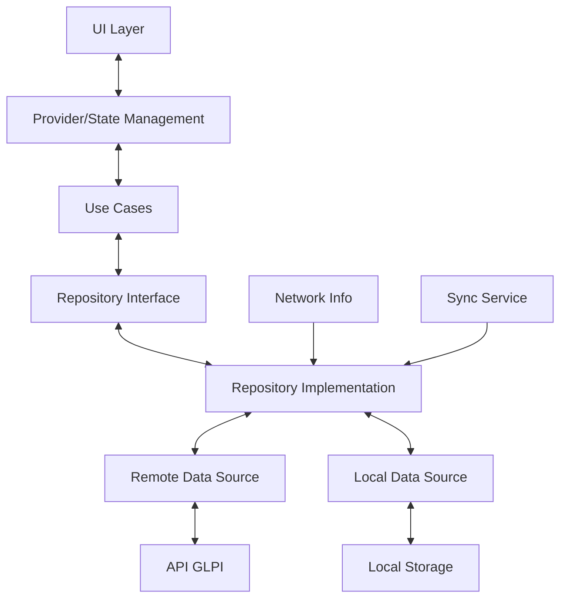
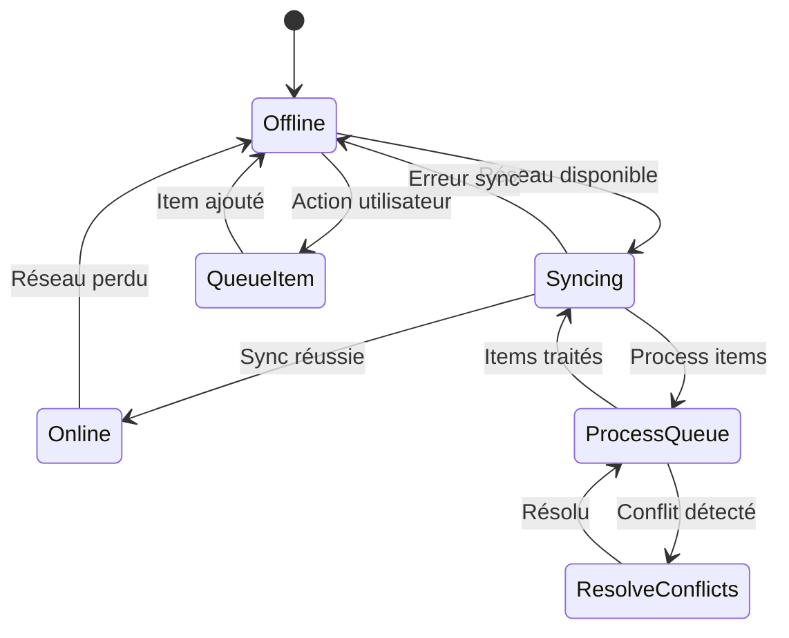

# Architecture Technique - Application Mobile Inventaire

## Stack Technique

### Frontend Mobile (Flutter)
- **Framework**: Flutter 3.x
- **Langage**: Dart
- **State Management**: Riverpod ou Bloc
- **Storage Local**: Hive / SQLite
- **HTTP Client**: Dio
- **Scanner**: mobile_scanner
- **Photos**: image_picker
- **GPS**: geolocator
- **Offline**: drift (SQL offline-first)

### Backend (GLPI 11)
- **Core**: PHP 8.1+
- **Framework**: GLPI Core
- **API**: REST API GLPI native + extensions custom
- **Base de données**: MySQL 8.0 / MariaDB 10.5+
- **Authentification**: API Token + Session

## Architecture de l'application Flutter

```
flutter_app/
├── lib/
│   ├── main.dart
│   ├── core/
│   │   ├── config/
│   │   │   ├── app_config.dart
│   │   │   ├── api_config.dart
│   │   │   └── theme_config.dart
│   │   ├── constants/
│   │   │   ├── api_endpoints.dart
│   │   │   ├── app_constants.dart
│   │   │   └── storage_keys.dart
│   │   ├── errors/
│   │   │   ├── exceptions.dart
│   │   │   └── failures.dart
│   │   ├── network/
│   │   │   ├── api_client.dart
│   │   │   ├── network_info.dart
│   │   │   └── interceptors.dart
│   │   └── utils/
│   │       ├── date_utils.dart
│   │       ├── validators.dart
│   │       └── helpers.dart
│   │
│   ├── features/
│   │   ├── auth/
│   │   │   ├── data/
│   │   │   │   ├── models/
│   │   │   │   │   ├── user_model.dart
│   │   │   │   │   └── session_model.dart
│   │   │   │   ├── repositories/
│   │   │   │   │   └── auth_repository.dart
│   │   │   │   └── datasources/
│   │   │   │       ├── auth_local_datasource.dart
│   │   │   │       └── auth_remote_datasource.dart
│   │   │   ├── domain/
│   │   │   │   ├── entities/
│   │   │   │   │   └── user.dart
│   │   │   │   ├── repositories/
│   │   │   │   │   └── auth_repository_interface.dart
│   │   │   │   └── usecases/
│   │   │   │       ├── login.dart
│   │   │   │       ├── logout.dart
│   │   │   │       └── get_current_user.dart
│   │   │   └── presentation/
│   │   │       ├── providers/
│   │   │       │   └── auth_provider.dart
│   │   │       ├── screens/
│   │   │       │   ├── login_screen.dart
│   │   │       │   └── entity_selection_screen.dart
│   │   │       └── widgets/
│   │   │           └── login_form.dart
│   │   │
│   │   ├── inventory_campaign/
│   │   │   ├── data/
│   │   │   │   ├── models/
│   │   │   │   │   ├── campaign_model.dart
│   │   │   │   │   └── mission_model.dart
│   │   │   │   └── repositories/
│   │   │   │       └── campaign_repository.dart
│   │   │   ├── domain/
│   │   │   │   ├── entities/
│   │   │   │   │   ├── campaign.dart
│   │   │   │   │   └── mission.dart
│   │   │   │   └── usecases/
│   │   │   │       ├── get_my_missions.dart
│   │   │   │       └── sync_mission_data.dart
│   │   │   └── presentation/
│   │   │       ├── providers/
│   │   │       │   └── campaign_provider.dart
│   │   │       ├── screens/
│   │   │       │   ├── missions_list_screen.dart
│   │   │       │   └── mission_detail_screen.dart
│   │   │       └── widgets/
│   │   │           └── mission_card.dart
│   │   │
│   │   ├── equipment_scan/
│   │   │   ├── data/
│   │   │   │   ├── models/
│   │   │   │   │   ├── equipment_model.dart
│   │   │   │   │   └── scan_result_model.dart
│   │   │   │   └── repositories/
│   │   │   │       └── equipment_repository.dart
│   │   │   ├── domain/
│   │   │   │   ├── entities/
│   │   │   │   │   ├── equipment.dart
│   │   │   │   │   └── computer.dart
│   │   │   │   └── usecases/
│   │   │   │       ├── scan_equipment.dart
│   │   │   │       ├── search_equipment.dart
│   │   │   │       └── update_equipment.dart
│   │   │   └── presentation/
│   │   │       ├── providers/
│   │   │       │   └── equipment_provider.dart
│   │   │       ├── screens/
│   │   │       │   ├── scanner_screen.dart
│   │   │       │   ├── equipment_detail_screen.dart
│   │   │       │   └── equipment_form_screen.dart
│   │   │       └── widgets/
│   │   │           ├── scanner_view.dart
│   │   │           └── equipment_info_card.dart
│   │   │
│   │   ├── inventory_collection/
│   │   │   ├── data/
│   │   │   │   ├── models/
│   │   │   │   │   ├── inventory_item_model.dart
│   │   │   │   │   └── photo_model.dart
│   │   │   │   └── repositories/
│   │   │   │       └── inventory_repository.dart
│   │   │   ├── domain/
│   │   │   │   ├── entities/
│   │   │   │   │   └── inventory_item.dart
│   │   │   │   └── usecases/
│   │   │   │       ├── create_inventory_item.dart
│   │   │   │       ├── update_inventory_item.dart
│   │   │   │       └── add_photo.dart
│   │   │   └── presentation/
│   │   │       ├── providers/
│   │   │       │   └── inventory_provider.dart
│   │   │       ├── screens/
│   │   │       │   ├── inventory_form_screen.dart
│   │   │       │   └── photo_capture_screen.dart
│   │   │       └── widgets/
│   │   │           ├── inventory_form.dart
│   │   │           └── photo_gallery.dart
│   │   │
│   │   ├── sync/
│   │   │   ├── data/
│   │   │   │   ├── models/
│   │   │   │   │   └── sync_queue_model.dart
│   │   │   │   └── repositories/
│   │   │   │       └── sync_repository.dart
│   │   │   ├── domain/
│   │   │   │   ├── entities/
│   │   │   │   │   └── sync_item.dart
│   │   │   │   └── usecases/
│   │   │   │       ├── queue_sync.dart
│   │   │   │       ├── process_sync_queue.dart
│   │   │   │       └── resolve_conflicts.dart
│   │   │   └── presentation/
│   │   │       ├── providers/
│   │   │       │   └── sync_provider.dart
│   │   │       ├── screens/
│   │   │       │   └── sync_status_screen.dart
│   │   │       └── widgets/
│   │   │           └── sync_indicator.dart
│   │   │
│   │   └── reporting/
│   │       ├── data/
│   │       │   └── repositories/
│   │       │       └── report_repository.dart
│   │       ├── domain/
│   │       │   └── entities/
│   │       │       └── inventory_stats.dart
│   │       └── presentation/
│   │           ├── screens/
│   │           │   └── reports_screen.dart
│   │           └── widgets/
│   │               └── stats_card.dart
│   │
│   └── shared/
│       ├── widgets/
│       │   ├── custom_button.dart
│       │   ├── custom_text_field.dart
│       │   ├── loading_indicator.dart
│       │   └── error_widget.dart
│       └── services/
│           ├── storage_service.dart
│           ├── location_service.dart
│           ├── camera_service.dart
│           └── scanner_service.dart
│
├── test/
├── pubspec.yaml
└── README.md
```

## Modèles de données

### Base de données locale (Hive/Drift)

```dart
// Tables principales
- users
- entities
- missions
- campaigns
- equipment_cache
- inventory_items
- sync_queue
- photos_pending
- settings
```

### Flux de données



## API GLPI - Extensions nécessaires

### Nouveaux endpoints à créer

#### 1. Gestion des campagnes d'inventaire
```
GET    /api/inventory/campaigns
GET    /api/inventory/campaigns/{id}
POST   /api/inventory/campaigns
PUT    /api/inventory/campaigns/{id}
DELETE /api/inventory/campaigns/{id}

GET    /api/inventory/campaigns/{id}/missions
GET    /api/inventory/campaigns/{id}/progress
```

#### 2. Gestion des missions techniciens
```
GET    /api/inventory/missions
GET    /api/inventory/missions/{id}
GET    /api/inventory/missions/my-missions
POST   /api/inventory/missions/{id}/start
POST   /api/inventory/missions/{id}/complete

GET    /api/inventory/missions/{id}/equipment-list
POST   /api/inventory/missions/{id}/sync-data
```

#### 3. Inventaire sur terrain
```
POST   /api/inventory/scan
POST   /api/inventory/equipment/verify
POST   /api/inventory/equipment/update
POST   /api/inventory/equipment/create
POST   /api/inventory/equipment/add-photo

GET    /api/inventory/search
POST   /api/inventory/report-anomaly
```

#### 4. Synchronisation
```
POST   /api/inventory/sync/batch
POST   /api/inventory/sync/validate
GET    /api/inventory/sync/conflicts
POST   /api/inventory/sync/resolve-conflict
```

#### 5. Rapports
```
GET    /api/inventory/reports/campaign/{id}
GET    /api/inventory/reports/mission/{id}
GET    /api/inventory/reports/technician/{id}
GET    /api/inventory/exports/campaign/{id}
```

## Gestion du mode hors-ligne

### Stratégie de synchronisation



### Gestion des conflits

**Types de conflits:**
1. Modification concurrente (même équipement modifié par 2 techniciens)
2. Équipement supprimé entre-temps
3. Données incohérentes

**Résolution:**
- Last-write-wins pour données non critiques
- Demande validation manager pour données critiques
- Fusion intelligente quand possible

## Sécurité

### Authentification
- API Token GLPI stocké de manière sécurisée (flutter_secure_storage)
- Session timeout automatique
- Verrouillage par code PIN/biométrie

### Données
- Chiffrement des données locales sensibles
- HTTPS uniquement pour communications
- Nettoyage des données après déconnexion
- Validation des permissions par entité

### Photos
- Compression avant upload
- Métadonnées EXIF nettoyées
- Stockage temporaire local
- Suppression après sync réussie

## Performance

### Optimisations
- Pagination des listes
- Lazy loading des images
- Cache intelligent
- Prefetching des données mission
- Compression des payloads API
- Batch des opérations de sync

### Métriques à surveiller
- Temps de synchronisation
- Taille de la base locale
- Consommation batterie
- Usage réseau
- Temps de réponse API

## Tests

### Stratégie de tests
- Unit tests: logique métier et use cases
- Widget tests: composants UI
- Integration tests: flux complets
- Tests offline: simulation réseau instable
- Tests de synchronisation: gestion conflits

## Déploiement

### Android
- Min SDK: 21 (Android 5.0)
- Target SDK: 33+
- Distribution: APK direct ou Google Play (privé)

### iOS
- Min version: iOS 12.0
- Distribution: TestFlight ou App Store (enterprise)

### CI/CD
- GitHub Actions / GitLab CI
- Build automatisés
- Tests automatisés
- Déploiement sur stores
