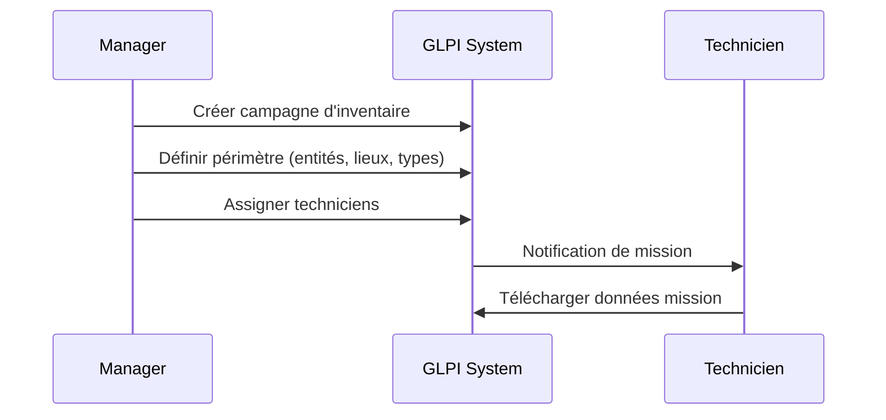
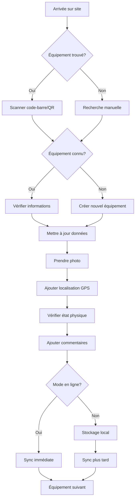
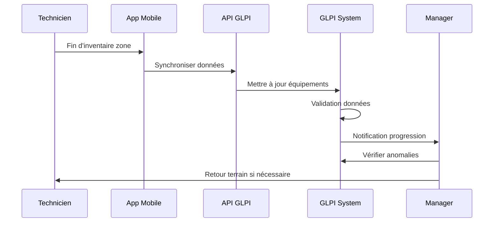
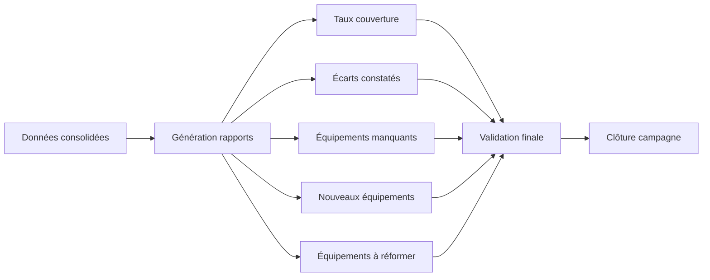

# Processus d'Inventaire de Matériel Informatique

## Vue d'ensemble du processus

L'inventaire de matériel informatique dans un contexte multi-entreprises suit un processus structuré en plusieurs phases.

## Phases de l'inventaire

### Phase 1: Préparation (Bureau)


**Actions:**
- Création d'une campagne d'inventaire dans GLPI
- Définition du périmètre: entités, lieux, types d'équipements
- Attribution des zones/bâtiments aux techniciens
- Génération de listes d'équipements attendus
- Création d'étiquettes/QR codes si nécessaire

### Phase 2: Sur le terrain (Mobile)


**Actions technicien:**
1. **Identification équipement**
   - Scanner code-barre/QR code
   - Recherche par numéro de série/nom
   - Recherche par type/localisation

2. **Vérification données**
   - Numéro de série
   - Modèle et fabricant
   - Configuration (RAM, CPU, disque)
   - Numéro d'inventaire
   - Affectation (utilisateur/service)

3. **Mise à jour informations**
   - Localisation exacte (salle, étage, armoire)
   - État physique (neuf, bon, défectueux, à réformer)
   - Coordonnées GPS
   - Photos de l'équipement
   - Commentaires/observations

4. **Gestion anomalies**
   - Équipement manquant
   - Équipement non répertorié
   - Incohérences données
   - Problèmes techniques constatés

### Phase 3: Synchronisation et Validation


**Actions:**
- Synchronisation des données collectées
- Validation automatique des données
- Revue des anomalies par le manager
- Ajustements et corrections

### Phase 4: Rapports et Clôture


## Types de données collectées

### 1. Ordinateurs (Computers)
- Fabricant, modèle
- Numéro de série
- Type (Desktop, Laptop, Server)
- Configuration: CPU, RAM, stockage
- Système d'exploitation
- Utilisateur affecté
- Localisation physique
- État et commentaires

### 2. Périphériques (Peripherals)
- Moniteurs
- Imprimantes
- Scanners
- Équipements réseau
- Téléphones

### 3. Composants
- Disques durs supplémentaires
- Modules RAM
- Cartes réseau
- Autres composants

### 4. Logiciels (si applicable)
- Licences installées
- Versions
- Clés de licence

## Modes de fonctionnement

### Mode Connecté
- Synchronisation en temps réel
- Accès à toutes les données GLPI
- Validation immédiate
- Notifications instantanées

### Mode Hors-ligne
- Stockage local des données
- Synchronisation différée
- Gestion des conflits
- File d'attente de synchronisation

## Gestion Multi-entreprises

### Hiérarchie des entités
```
Groupe (Holding)
├── Entreprise A
│   ├── Site A1
│   └── Site A2
├── Entreprise B
│   └── Site B1
└── Entreprise C
    ├── Site C1
    └── Site C2
```

### Permissions et visibilité
- Technicien: voit uniquement ses missions et entités assignées
- Responsable entité: voit son entité et sous-entités
- Administrateur groupe: voit toutes les entités du groupe

## Indicateurs de performance (KPI)

1. **Taux de couverture**: % équipements inventoriés / équipements attendus
2. **Taux de nouveaux**: % équipements découverts non répertoriés
3. **Taux d'anomalies**: % équipements avec incohérences
4. **Taux de manquants**: % équipements non trouvés
5. **Temps moyen par équipement**
6. **Progression par technicien**

## Bonnes pratiques

1. **Préparation**
   - Vérifier la charge de la tablette/smartphone
   - Télécharger toutes les données nécessaires
   - Prévoir mode hors-ligne dans les zones sans réseau

2. **Sur terrain**
   - Suivre un parcours logique (étage par étage)
   - Prendre des photos de qualité
   - Noter immédiatement les anomalies
   - Synchroniser régulièrement

3. **Qualité des données**
   - Vérifier la cohérence des numéros de série
   - Confirmer les affectations utilisateurs
   - Documenter les états physiques
   - Être précis sur les localisations

4. **Sécurité**
   - Ne pas déplacer les équipements
   - Respecter les zones à accès restreint
   - Protéger les données sensibles
   - Verrouiller l'application lors des pauses
